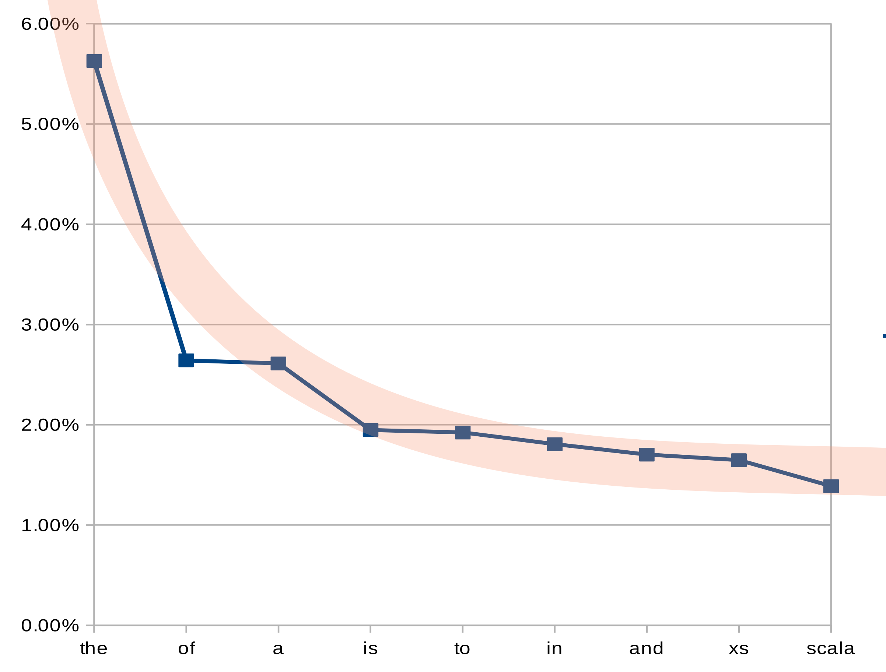

#### Information Retrieval <span class="right">Innopolis University <br> Krikun Gosha</span>

-------------------------------------------------------------------------------

## HW3 <small>Little Research Report</small>

[repository](https://gitlab.com/krikun/ir-qq)

### 0 Structure

```bash
project/                 # little research project
project/docs/            # test document set
project/src/main/scala   # research scala src
                      
project/tasks/           # this reports from .md
```

build with sbt

```bash
# git clone ssh or https ..
cd project
sbt
...

> run
```

### 1 Doc set

placed in `project/docs/` directory

<div class="row">
<div class="col-xs-7">

| docId | terms | <small> tokens </small> |
| ----- | ------: | :-------- |
| docs/arrays | 502 | <small> 1948 </small> | 
| docs/mutable-and-immutable-collections | 362 | <small> 1048 </small> | 
| docs/collection-sets | 453 | <small> 1854 </small> | 
| docs/collections-trait-traversable | 434 | <small> 1633 </small> | 
| docs/collections-trait-iterable | 278 | <small> 713 </small> | 
| docs/maps | 447 | <small> 1810 </small> | 
| docs/scala-for-java-programmers | 962 | <small> 4983 </small> | 
| docs/classes | 227 | <small> 430 </small> | 
| docs/sets | 453 | <small> 1854 </small> | 

</div>
</div>

### 1.1 Total tokens

```markdown
tokens : 16273
terms  : 1709 (merged)
```
_tokens split by Punct and normalized to terms just by lowercase,
quotes and apostrophe stays_

```scala
  val raw = io.Source.fromFile(file).mkString
  // tokenization
  val tokens = raw.split("[\\p{Punct}\\s]+")
  val words = tokens.map(word => word.toLowerCase())
  val roughly = words.toSet
```

&nbsp;
&nbsp;
&nbsp;


<div class="row">
<div class="col-xs">

### 1.2 Stop words

First 9 by occurrence:

| the | of  | a   | is  | to  | in  | and | xs  | scala | 
|:---:|:---:|:---:|:---:|:---:|:---:|:---:|:---:|:-----:|
| 916 | 430 | 425 | 317 | 313 | 294 | 277 | 268 | 226   | 

#### Total: 3466 out of 16273 tokens

> As we can see, this is logarithmic distribution.
> **xs** and **scala** appears because of test doc set:
> [src](http://docs.scala-lang.org/tutorials/)

</div>
<div class="col-xs">

or, if you wanna, by percentage to tokens:



</div>
</div>

### 2 Queries

**define**

<div class="row">
<div class="col-xs">

#### Boolean search

> 200th most frequent
> occurrence : 15
> 5 of 9 documents

</div>
<div class="col-xs">

#### Result `docId`:

```bash
docs/arrays
docs/mutable-and-immutable-collections
docs/collections-trait-traversable
docs/maps
docs/scala-for-java-programmers
```

</div>
</div>

<div class="row">
<div class="col-xs">

#### Edit distance, less or equal 1

Matched words: 
**define, defined, defines**

> Recall increase,
> 7 of 9 documents

</div>
<div class="col-xs">

#### Result `docId`:

```bash
docs/scala-for-java-programmers
docs/arrays
docs/classes
docs/maps
docs/collections-trait-iterable
docs/collections-trait-traversable
docs/mutable-and-immutable-collections                                                                                           
```

</div>
</div>

### compuet (with typo)

<div class="row">
<div class="col-xs">

#### Boolean search

> doesn't appear
> as and compute

</div>
<div class="col-xs">

#### Relevant docId:

`none`

</div>
</div>

<div class="row">
<div class="col-xs">

#### Edit distance, less or equal 1

Matched words: 
**computed, computes, complex, compact**

> Recall increase,
> 2 of 9 documents

</div>
<div class="col-xs">

#### Relevant docId:

```bash
docs/collections-trait-traversable
docs/maps
```

</div>
</div>
